# A mechanistic translational PK / biodistribution model for intrathecal AAV gene therapy

*Mouse → cynomolgus → human, built on a mechanistic compartmental model of vector disposition in the CSF–CNS axis.*

<!-- Repo: github.com/tjmb03/AAV-IT-DMPK -->


[](https://aav-it-dmpk-3ureudedfuzyuhpxhsqtar.streamlit.app/)
---

## Overview

A self-contained Python package implementing a mechanistic model of how an intrathecally (IT) delivered AAV vector distributes through the cerebrospinal fluid, transduces CNS tissue, expresses a transgene, effluxes to blood, and clears — and how that behavior translates across species for first-in-human dose selection. The model is an explicit system of ODEs with mechanistically named rate constants, integrated directly; every reported quantity is traceable to a term in the right-hand side.

**Scope and caveats.**

- All parameters are representative, order-of-magnitude literature values — a starting scaffold. No specific dose, fold-change, or projection here should drive a decision until the parameters are replaced with program-specific species-, strain-, serotype-, and route-specific data. The structure is the contribution; the numbers are placeholders.
- The model is deliberately coarse (three CSF/CNS segments, well-mixed tissue compartments). Method validation — verification, predictive checks, calibration, sensitivity (see *Validation*) — is implemented and runs in CI; quantitative validation against program data is not, and would require that data. Finer intra-brain regional structure is the obvious refinement.

---

## The scientific idea

For a vector delivered into the CSF, what differs between mouse, monkey, and human is **physiology** — CSF volume, CSF turnover (production/absorption rate), and CNS tissue mass — all measurable and species-specific. What is comparatively **conserved** is the **biology** at the cell level: the rates of uptake from CSF into tissue, transduction, expression, and turnover. The model separates the two cleanly: cross-species translation means **swapping the physiology while holding the biology fixed**, then asking what dose in the next species reproduces the exposure that mattered in the current one. Body-weight (mg/kg) scaling is generally the wrong basis for a CSF-delivered agent, because the determinant of CNS exposure is CSF volume and turnover, not body mass — and the package quantifies this rather than assuming it.

---

## How the model is built

<p align="center">
  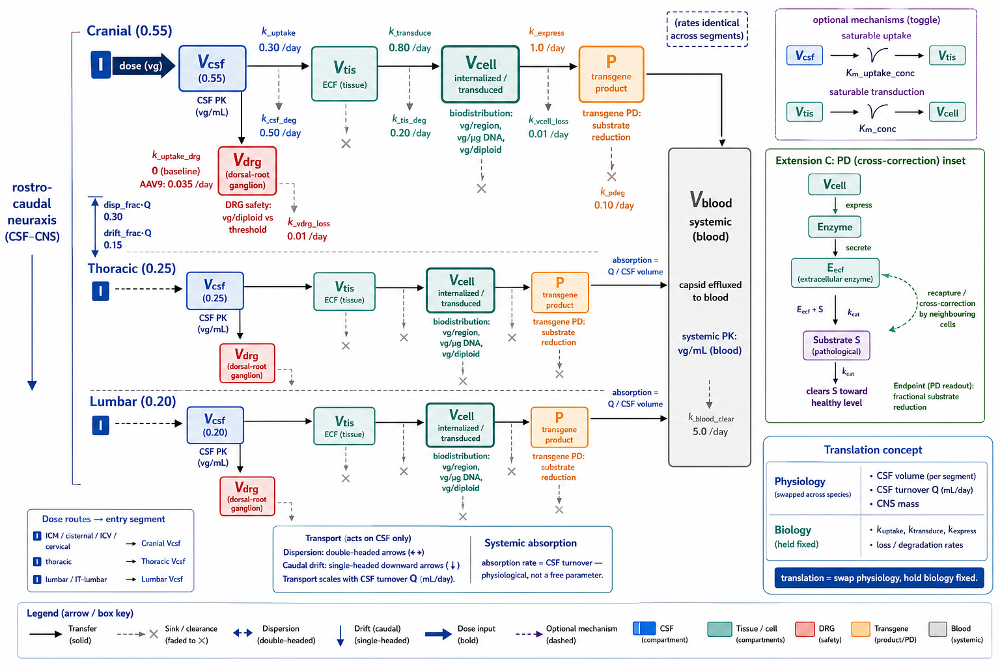
  <br/><sub>Compartmental structure: three rostro-caudal CSF/CNS segments (CSF → tissue → transduced cell → transgene) with a DRG safety branch, linked by CSF dispersion and caudal drift and draining to blood.</sub>
</p>

The neuraxis is discretized rostral → caudal into three CSF/CNS segments — **cranial, thoracic, lumbar** — so the model represents the clinically decisive difference between **intra-cisterna-magna (ICM) / cisternal** dosing and **lumbar IT** dosing. Each segment carries five states:

| State | Meaning | Role |
|---|---|---|
| `Vcsf` | free vector in the CSF segment | what longitudinal transport and clearance act on |
| `Vtis` | free vector in tissue extracellular space | the pool available for transduction |
| `Vcell` | internalized / transduced vector | the biodistribution readout (vg per region) |
| `Vdrg` | vector in the dorsal-root-ganglion compartment | the DRG safety readout; active when a serotype specifies ganglionic avidity (see *Extensions A*) |
| `P` | expressed transgene product | the pharmacodynamic surrogate |

plus one systemic compartment (`Vblood`) for capsid that has effluxed to blood — **sixteen states** in all. (The DRG compartment is present but dormant under the generic baseline and becomes active when a serotype sets ganglionic avidity.)

The processes (all first-order unless saturable kinetics are switched on):

- **Longitudinal transport** dominated by **dispersion / pulsatile mixing** between adjacent segments, with a small net caudal drift. This dispersion-dominated transport is what makes a *lumbar* dose reach the brain poorly relative to a *cisternal* dose.
- **CSF clearance** by degradation plus **distributed absorption to blood**, where the absorption rate is set equal to the **CSF turnover (Q / CSF volume)** — a physiological, species-specific quantity, not a free parameter.
- **CSF → tissue uptake**, then **transduction** (with an optional saturable mode), then slow **loss of internalized vector** (≈ stable in post-mitotic neurons), then **expression** with protein turnover.
- an optional parallel **CSF → DRG uptake** into the per-segment dorsal-root-ganglion compartment — the route-relevant safety tissue (*Extensions A*).

Because the default model is linear in dose, it integrates a **unit dose and scales** the trajectory — which keeps the stiff system well-scaled and makes the dose → exposure relationship exact. (With saturable kinetics it integrates at the true dose.)

Headline behaviors reproduced (visible in the figures): an ICM dose produces a **rostro-caudal *decreasing* transduction gradient** (strong brain), a lumbar dose the reverse; and in this illustrative parameterization a cisternal dose reaches the brain **~5×** better than a lumbar dose of the same size.

---

## Key modeling decisions

**The dose-normalization basis is an output, not an assumption — and it depends on the presumed efficacy driver.** The translation step matches the same efficacious mouse dose under three candidate drivers (cranial CSF exposure, transduced vector per gram, peak transgene) and reports the projected dose on four normalization bases. The basis that stays flat across the NHP → human bridge is *different for each driver* — it lands on per-mL-CSF when CSF exposure drives effect, on per-kg when tissue transduction drives it. So "which scaling rule should we use?" is contingent on the exposure–response hypothesis, and the model's job is to quantify that contingency rather than paper over it.

**Identifiability.** When new NHP data arrive, the package does *not* re-fit every rate constant. It fits two multipliers — CSF→tissue **uptake** and CSF **clearance** — chosen because they are what the data can actually inform. In this regime transduction of already-delivered vector is fast relative to tissue clearance, so the internalized amount is **uptake-limited and nearly insensitive to the transduction rate**: fitting a transduction multiplier from biodistribution alone would be ill-posed. The identifiability is bought by using **two complementary data streams** — terminal tissue biodistribution (which sees uptake) and early **CSF PK** (which sees clearance). Together they separate cleanly; against tissue alone they confound.

**Absolute exposure anchors behave differently from cross-species ratio anchors under a model update.** The data-integration step anchors the human dose to a *fixed* efficacy target (a transduced-vector-per-gram level), not to a species-to-species ratio. Under conserved biology a single global multiplier cancels in a pure ratio match, so fresh data could not move the projected dose. Anchoring on an absolute, exposure–response-derived target is what lets new data actually update the recommendation.

---

## Demo output

`python demo.py` produces five console sections and four figures in `./outputs/`:

1. **Species physiology** used for translation (CSF volume, turnover, CNS mass).
2. **NHP cisternal kinetics** — exposure metrics for an ICM dose, plus the cisternal-vs-lumbar brain-transduction ratio. *(fig1, fig2)*
3. **Cross-species translation** of an efficacious mouse dose to NHP and human under three efficacy drivers, with the implied body-weight exponent (mouse→human vs NHP→human) and the most-stable normalization basis per driver. *(fig3)*
4. **Real-time data integration** — a new two-stream NHP dataset is fit (recovering the true uptake and clearance multipliers), and the human dose is refreshed (to **0.61×** in the demo). *(fig4)*
5. A **study-style biodistribution table** (vg, vg/µg DNA, vg per diploid genome).

<table>
<tr>
<td width="50%">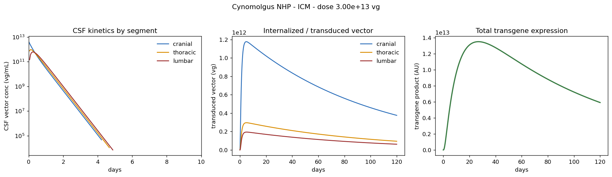<br/><sub>CSF clearance, regional transduction, and expression time-courses (NHP, ICM).</sub></td>
<td width="50%">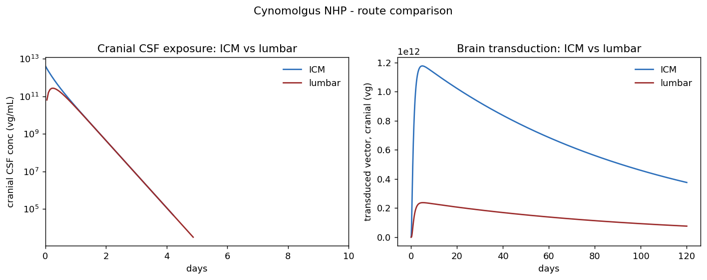<br/><sub>ICM vs lumbar: cranial CSF exposure and brain transduction.</sub></td>
</tr>
<tr>
<td width="50%">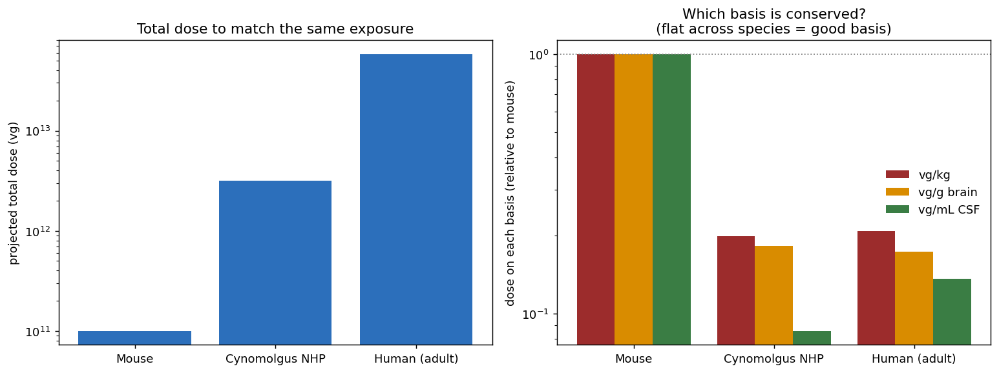<br/><sub>Projected cross-species dose and which normalization basis is conserved.</sub></td>
<td width="50%">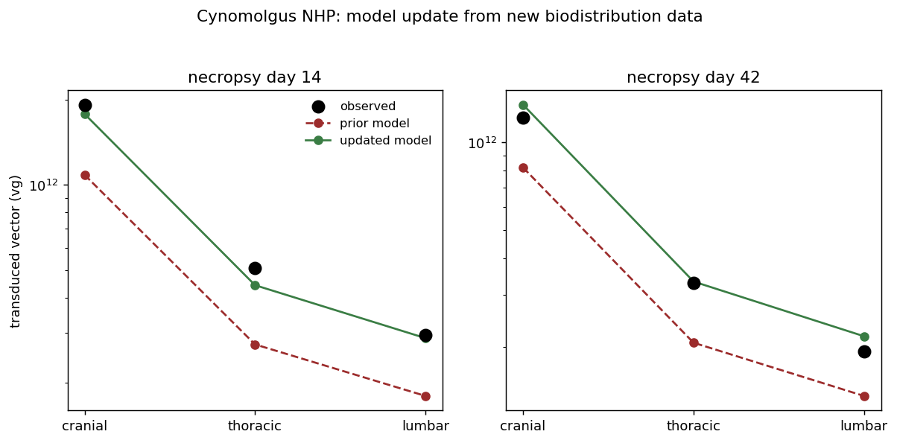<br/><sub>Prior vs data-updated model against new biodistribution, by necropsy day.</sub></td>
</tr>
</table>

---

## Extensions

Four extensions layer onto the baseline. They are coupled around a single capsid — **AAV9** — so the trade-offs are concrete: the serotype that buys CNS transduction also drives the dorsal-root-ganglion load; saturable uptake bends the high-dose response; the transgene's pharmacodynamics, not vector genomes, set the efficacious dose; and a Bayesian update turns the human-dose point estimate into an interval. Exercised by `python demo_extensions.py` (writes `fig5`–`fig8`); the baseline `demo.py` is unchanged.

**A. Capsid serotype — coupling efficacy and DRG safety.** `physiology.SEROTYPES` carries tropism multipliers (parenchymal uptake/transduction efficiency and DRG avidity); `model.apply_serotype` applies them. AAV9 is represented as broad-CNS but **DRG-avid**; a miRNA-detargeted variant — the real strategy of incorporating DRG-active miR-183/miR-182 target sites — preserves CNS transduction while suppressing ganglionic expression. Dorsal root ganglia are the **dose-limiting toxicity site** for IT AAV in NHPs, so this is the safety lever the model represents. The demo shows AAV9 raising CNS transduction ~1.3× over a generic capsid *and* raising DRG load; the safety readout (`pd_safety.drg_load_table`, in vg per diploid genome with a margin to an illustrative tolerability threshold) shows the **cranial ganglia exceeding threshold under a cisternal dose, the hotspot relocating to the lumbar DRG under lumbar dosing, and detargeting bringing every ganglion under threshold at unchanged CNS exposure.** → `model.py` (`apply_serotype`, `Vdrg` state), `physiology.py` (`SEROTYPES`, `drg_mass_g`), `pd_safety.py` (`drg_load_table`); *fig6*

**B. Saturable (receptor-limited) uptake.** CSF→tissue uptake switches from first-order to Michaelis–Menten (`saturable_uptake`, `Km_uptake_conc`), reflecting finite cell-surface receptor / attachment-factor capacity. The consequence is mechanistic: per-vg transduction efficiency **falls** once concentration approaches half-saturation, so escalation yields diminishing CNS exposure — and the dose→exposure map is no longer linear (the model accordingly integrates at the true dose instead of scaling a unit-dose solution). → `model.py` (`_build_rhs`, `simulate`); *fig5*

**C. Transgene PD — a secreted, cross-correcting enzyme.** The canonical CNS gene-therapy mechanism is modeled explicitly: transduced cells express enzyme, secrete a fraction, neighbouring cells take it up (**cross-correction**), and intracellular plus cross-corrected enzyme clears an accumulated substrate toward a healthy level. The PD endpoint is fractional substrate reduction per region; `pd_safety.dose_for_pd_target` inverts it to the dose for a target (≈1.6e13 vg for ≥70% brain substrate reduction in the illustrative human / ICM / AAV9 case). This is where the efficacious dose is anchored to a **pharmacodynamic** readout rather than to vector genomes — and the rostro-caudal gradient shows cord correction lagging brain under a cisternal dose. Computed on top of the (linear) vector trajectory so the small enzyme/substrate system stays well-scaled. → `pd_safety.py` (`pd_response`, `dose_for_pd_target`, `DEFAULT_TRANSGENE`); *fig7*

**D. Bayesian updating — a dose with a credible interval.** The point-estimate refit is augmented with a self-contained random-walk **Metropolis** sampler (no extra dependencies; the linear baseline lets each likelihood evaluation use an exact matrix-exponential propagator, so a full run is seconds). Weakly-informative lognormal priors on the two identifiable multipliers and a log-space, assay-CV-scaled likelihood give a joint posterior, propagated through the dose projection to a **95% credible interval on the recommended human dose**. In the demo, two NHP necropsy cohorts plus early CSF PK constrain the human dose to roughly a **±17% band** around the point estimate — a defensible interval rather than a single number. → `data_integration.py` (`bayesian_update_from_observations`, `propagate_dose_posterior`); *fig8*

<table>
<tr>
<td width="50%">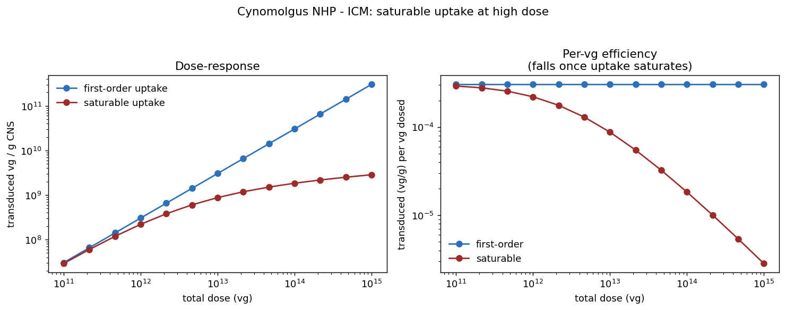<br/><sub>First-order vs saturable uptake: dose–response and per-vg efficiency.</sub></td>
<td width="50%">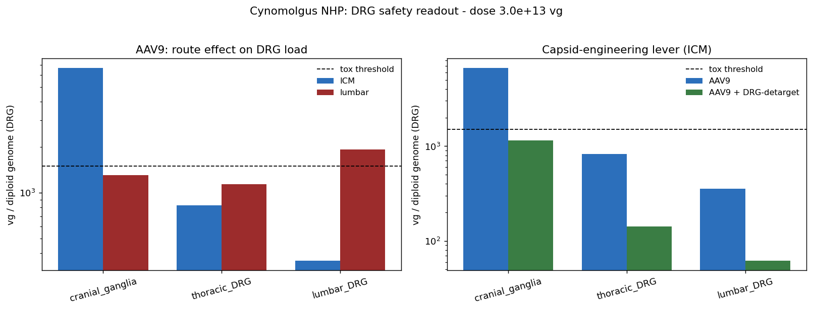<br/><sub>DRG load by ganglion: route effect (ICM vs lumbar) and the detargeting lever.</sub></td>
</tr>
<tr>
<td width="50%">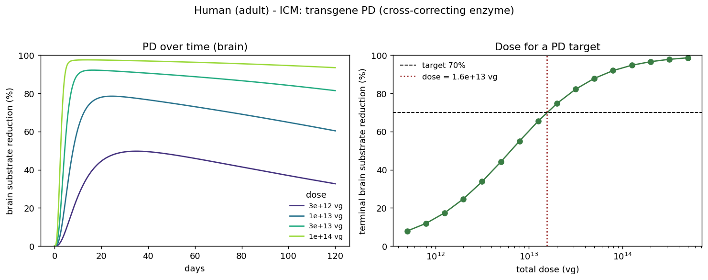<br/><sub>Substrate reduction over time and the dose for a PD target.</sub></td>
<td width="50%">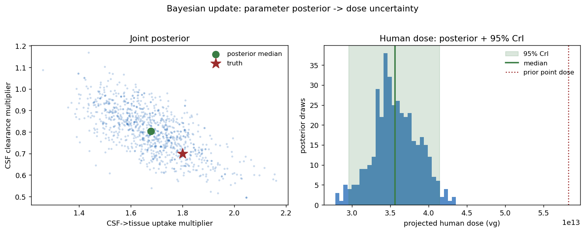<br/><sub>Joint parameter posterior and the human-dose 95% credible interval.</sub></td>
</tr>
</table>

---

## Validation

"Validation" means different things at different layers, and they are kept separate here. `validation.py` implements the mechanical checks (pure compute, so they are unit-tested and run in CI); `python demo_validation.py` runs the suite and writes `fig9`–`fig12`. With the illustrative parameters these validate the **method and implementation** — *quantitative* validation requires the program's own species-specific data.

- **Verification (is the math solved correctly?).** Vector-genome mass balance (states + cumulative sinks = dose, conserved to ~1e-15), agreement of the LSODA solution with the exact matrix-exponential solution of the linear model (~1e-8), solver-tolerance convergence, and limiting-case behaviour (zero uptake → no transduction; exact dose-linearity). → `mass_balance`, `verify_against_matrix_exponential`, `convergence`, `limiting_cases`; *fig9*
- **Predictive validation (does it predict held-out data?).** Posterior-predictive coverage and **leave-one-cohort-out** — fit on all but one necropsy cohort, predict the held-out one (within ~1.2-fold on the synthetic data). This is where the synthetic scaffold gets replaced by program data. → `posterior_predictive_check`, `leave_one_cohort_out`; *fig10*
- **Calibration (is the Bayesian posterior calibrated?).** Simulation-based calibration — draw truth from the prior, simulate, refit, and check rank uniformity. → `simulation_based_calibration`; *fig11*
- **Global sensitivity (which parameters move the decision?).** Sobol first-order and total indices on a decision output (terminal-state outputs use the exact linear propagator, so a full run is ~1 s). On the illustrative parameters, terminal transduction is governed mostly by vector persistence (`k_vcell_loss`) and uptake. → `sobol_indices`, `pipeline_sobol`; *fig12*

The **load-bearing assumption is conserved biology** ("swap physiology, hold biology fixed"). It is the most falsifiable element and should be stress-tested directly — estimate the biological constants independently in ≥2 species and test consistency; the package is built to relax to species-specific terms when it fails. And a model is qualified only relative to a **context of use**: state the question, assess model risk (influence × decision consequence, e.g. ASME V&V 40 / FDA's risk-informed credibility framework), and scale the evidence above to that risk.

<table>
<tr>
<td width="50%">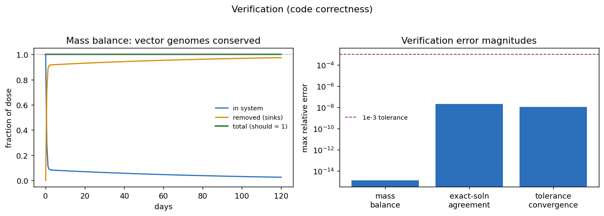<br/><sub>Mass-balance conservation and verification error magnitudes.</sub></td>
<td width="50%">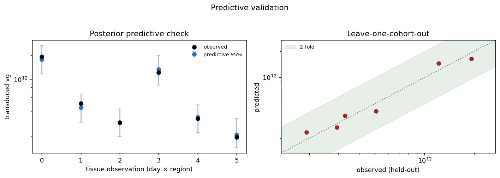<br/><sub>Posterior-predictive coverage and leave-one-cohort-out.</sub></td>
</tr>
<tr>
<td width="50%">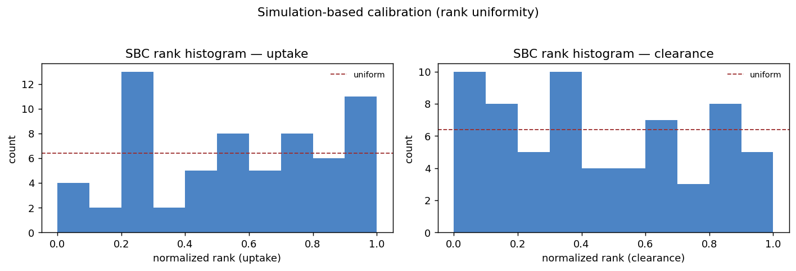<br/><sub>Simulation-based-calibration rank histograms.</sub></td>
<td width="50%">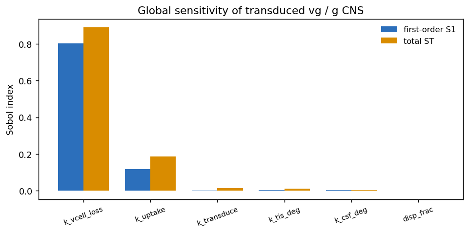<br/><sub>Global (Sobol) sensitivity of transduced vg per g CNS.</sub></td>
</tr>
</table>

**Visual predictive check (VPC).** `vpc.py` implements the predictive-check idiom standard in pharmacometrics, run with `python demo_vpc.py` (writes `fig13`–`fig14`). A replicate study is simulated at the observed design, summarized by its 5th/50th/95th percentiles per time bin, and the *observed* percentiles are checked against the simulated percentile bands — for the CSF PK stream on a time axis (with an optional prediction-corrected pcVPC, Bergstrand et al. 2011) and for biodistribution stratified by CNS region. This is a **posterior-predictive** VPC: the bands reflect posterior parameter uncertainty + residual (assay) error, *not* fitted between-subject random effects, because the mechanistic model is a typical-subject model (`make_synthetic_study` exposes a `bsv_cv` knob to inject between-animal variability and stress the check). → `make_synthetic_study`, `study_to_observation`, `vpc_csf`, `vpc_tissue`; *fig13, fig14*

<table>
<tr>
<td width="50%">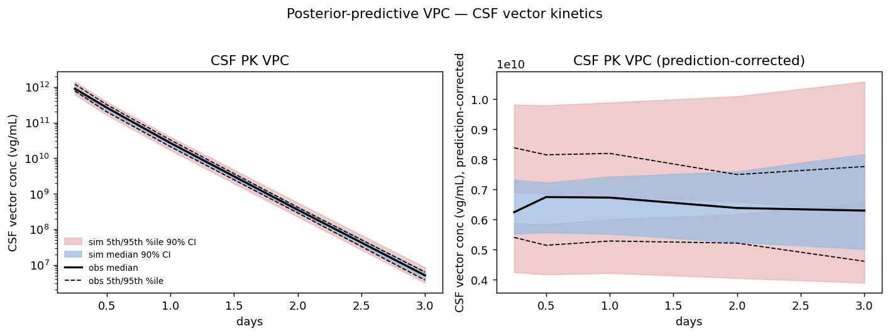<br/><sub>CSF PK VPC, standard and prediction-corrected.</sub></td>
<td width="50%">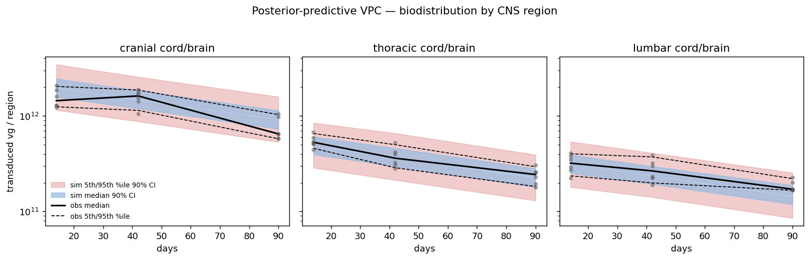<br/><sub>Biodistribution VPC stratified by CNS region.</sub></td>
</tr>
</table>

---

## Known limitations

- **Coarse spatial resolution.** Three well-mixed CSF/CNS segments; the DRG are represented as a lumped per-segment ganglionic compartment (uptake and transduction collapsed into one avidity constant), with no intra-brain regional gradient and no separate sensory-neuron subtype structure. Because parenchyma is averaged over a large brain mass, per-gram concentrations are diluted relative to thin cord segments — total vector remains brain-dominant after ICM, but the per-mass picture should not be over-read. Finer brain regions are the next refinement.
- **Illustrative parameters — including capsid, transgene, and tox.** Every rate constant, physiological value, serotype multiplier, PD constant, and the DRG tolerability threshold is a literature-scale placeholder. The serotype and PD numbers are shaped to demonstrate the *workflow and the trade-offs*, not to characterize any real product; the DRG threshold in particular stands in for a program-specific, histopathology-anchored value.
- **Nonlinearity is modeled but not yet fully composed.** Saturable uptake and the cross-correcting-enzyme PD are each implemented, but the PD cascade is computed on the linear vector trajectory; combining saturable uptake *with* PD in a single nonlinear solve is a small, identified next step.
- **Conserved-biology assumption is a hypothesis,** not a fact — cross-species differences in receptor expression, immune handling, and transduction efficiency can break it, and the framework is built so those enter as species-specific adjustments when data warrant.
- **Synthetic data.** Both the point-estimate and Bayesian updates fit to simulated observations; the machinery (two-stream identifiability, posterior, dose credible interval, VPC) is real, the dataset is illustrative.

---

## Selected references (general, for orientation)

These are pointers to the literature and guidance that inform the modeling choices, given by topic and source rather than as exact citations — please confirm current versions and details directly.

- FDA / CBER guidance on **preclinical assessment of investigational cellular and gene therapy products**, and on **long-term follow-up after administration of human gene therapy products** (delayed-effect monitoring).
- NHP **CSF/intrathecal AAV biodistribution and dorsal-root-ganglion toxicity** work from the Wilson / Hordeaux group and related vector-pharmacology literature.
- Comparative **CSF physiology and turnover** across rodent, nonhuman primate, and human (CSF volume, formation/absorption rate) from the CSF-dynamics literature.
- Literature on **route of CSF administration** (intra-cisterna-magna vs lumbar vs intracerebroventricular) and its effect on CNS vector distribution.
- **DRG detargeting** of AAV transgene expression via incorporation of ganglion-enriched **miRNA (miR-183/miR-182) target sites**, as a capsid/cassette engineering approach to the sensory-neuron toxicity.
- The **secreted-enzyme / cross-correction** paradigm for CNS lysosomal storage disorders (enzyme uptake by bystander cells via mannose-6-phosphate receptor), as the mechanistic basis of the PD model.
- **Bayesian / population-PK model updating** and credible-interval reporting for dose justification under sparse preclinical data; **visual predictive checks** (incl. prediction-corrected VPC) for model evaluation.

---

## Install & run

```bash
pip install -r requirements.txt
python demo.py              # baseline: kinetics, route, translation, data integration
python demo_extensions.py   # extensions: serotype/DRG, saturable uptake, PD, Bayesian
python demo_validation.py   # verification, predictive checks, SBC, Sobol sensitivity
python demo_vpc.py          # visual predictive checks (CSF PK and biodistribution)
pytest -q                   # the scientific claims, as tests (also run in CI)
```

Or install as a package: `pip install -e .` (library deps: NumPy, SciPy, matplotlib, pandas; Python 3.10+).

**Interactive app.** An interactive explorer (sidebar controls for species, route, serotype, dose; tabs for disposition, translation, DRG safety, saturable uptake, PD, and a live Bayesian update) is in `app.py`:
**Live app:**
https://aav-it-dmpk-3ureudedfuzyuhpxhsqtar.streamlit.app/

